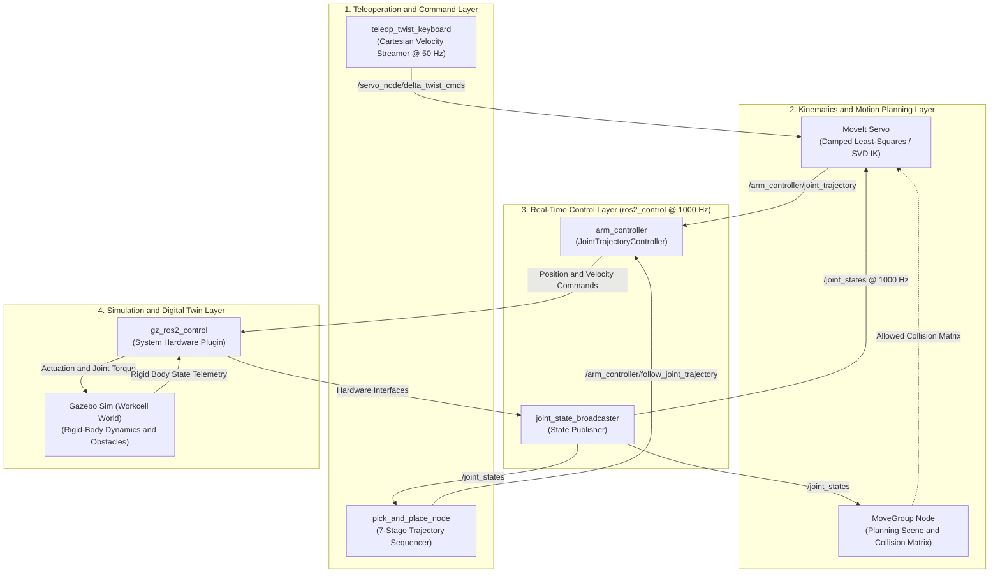

# 6-DOF Robotic Manipulator Digital Twin & Real-Time Teleoperation Suite

[](https://docs.ros.org/)
[](https://moveit.picknik.ai/)
[](https://gazebosim.org/)
[](https://control.ros.org/)

An industrial-grade **Software-in-the-Loop (SIL) Digital Twin** of a 6-DOF Anthropomorphic Manipulator with a Spherical Wrist ($6\text{R}$ kinematic chain). The framework incorporates standard Denavit-Hartenberg kinematic modeling, Levenberg-Marquardt singularity-damped Cartesian teleoperation via **MoveIt Servo**, sampling-based collision-avoiding trajectory generation via **MoveIt 2 / OMPL**, multi-body rigid dynamics in **Gazebo Sim**, and deterministic autonomous state-machine sequencing.

---

## Architecture Overview


---

## Kinematic & Dynamic Specifications

| Specification | Nominal Metric |
| :--- | :--- |
| **Kinematic Architecture** | $6\text{R}$ Anthropomorphic Chain with Spherical Wrist |
| **Pieper's Criterion Compliance** | Revolute Axes $\mathbf{z}_4, \mathbf{z}_5, \mathbf{z}_6$ intersect at $\mathbf{p}_{\text{wrist}}$ |
| **Maximum Reach** | $890\text{ mm}$ |
| **Simulated Payload Capacity** | $5.0\text{ kg}$ |
| **Control Frequency** | $1000\text{ Hz}$ (`ros2_control` inner loop) |
| **Teleoperation Frequency** | $50\text{ Hz}$ (`MoveIt Servo` task-space streaming) |
| **Kinematics Solvers** | KDL Numerical Solver & Damped Least-Squares (SVD) |

---

## Repository Structure

```text
manipulator_ws/src/
├── manipulator_description/        # Parametric URDF/Xacro, 3D inertial tensors, hardware tags
│   ├── config/                     # ros2_control hardware configurations
│   ├── urdf/                       # Parametric Xacro macros (inertials, ros2_control, joints)
│   └── launch/                     # Interactive RViz2 visual verification launch
├── manipulator_moveit_config/      # MoveIt 2 SRDF, OMPL profiles, kinematics plugins, limits
│   ├── config/                     # Allowed Collision Matrix (ACM), joint limits, kinematics.yaml
│   └── launch/                     # Standalone MoveGroup & RViz demo pipelines
├── manipulator_gazebo/             # Industrial workcell physics, SDF worlds, Gazebo-ROS bridges
│   ├── worlds/                     # SDF world featuring workcell pedestal, parts, and obstacles
│   └── launch/                     # Unified Gazebo Sim + MoveIt 2 + RViz launch pipeline
└── manipulator_teleop/             # Real-time Cartesian teleoperation & autonomous state machine
    ├── config/                     # MoveIt Servo configuration (damping thresholds, scales)
    ├── launch/                     # MoveIt Servo real-time teleoperation launch
    └── manipulator_teleop/         # Teleop twist node & 7-stage pick-and-place sequencer
```
---

## Quickstart & Execution

### 1. Prerequisites & Dependencies
```bash
sudo apt update
sudo apt install -y \
  ros-jazzy-moveit \
  ros-jazzy-moveit-servo \
  ros-jazzy-ros2-control \
  ros-jazzy-ros2-controllers \
  ros-jazzy-gz-ros2-control \
  ros-jazzy-ros-gz
2. Workspace Build
Bash
mkdir -p ~/manipulator_ws/src
cd ~/manipulator_ws
colcon build --symlink-install
source install/setup.bash
3. Execution Options
Option A: Full Gazebo Sim Dynamics Twin + MoveIt 2
Bash
ros2 launch manipulator_gazebo gazebo_moveit.launch.py
Option B: Real-Time Cartesian Joystick Teleoperation
Bash
# Terminal 1:
ros2 launch manipulator_moveit_config demo.launch.py

# Terminal 2:
ros2 launch manipulator_teleop teleop_servo.launch.py &
ros2 run manipulator_teleop teleop_twist_keyboard
Drive end-effector in 3D Cartesian space using W/S/A/D/R/F and roll/pitch/yaw using U/J/I/K/O/L.

Option C: 7-Stage Autonomous Pick-and-Place State Machine
Bash
ros2 run manipulator_teleop pick_and_place_node --ros-args -p use_sim_time:=true
